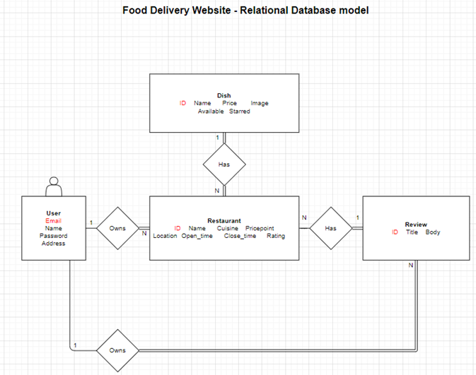

# Deliver Eat - Mock Food Delivery App

### **Technology used:**

- Node
- Express
- Postgres SQL
- React

### **Description**

A full stack web application that allows users to view restaurants (including their dishes and reviews), add dishes/items to their basket, and checkout. A user can also create their own restaurant and add their own dishes. All restaurants and locations are randomly generated and are not real establishments.

This project features:

- Responsive and efficient single page application using React.
- Fully functional REST API and CRUD operations for restaurants, dishes, reviews.
- File image upload and cloud image storage using Cloudinary.
- Functional authorisation and authentication using JSON web tokens.
- Location and map features using Mapbox API.
- Mock checkout and payment functionality using Stripe API.
- Security against cross site scripting, SQL injection.
- Seed restaurants and their dishes randomly using the seed script (npm run seed)

### **Learning and reflection**

This mock food delivery application was built to improve my skills in building full stack applications.
This project uses React as its front-end framework, with a node/Express back-end and a SQL database using Postgres.

#### _Planning and organisation_

- This project facilitated my learning in starting a full stack application from scratch. Starting with the project ideas and features, and utilising user-stories in determining what features and components are required. For example, I expected users to want to be able to review and rate restaurants, thus I planned for a reviews schema in the database early on.

- I used a relational databse model to plan out the tables and columns I required, and the relationships between these tables (see below). Having this schema planned was increbly helpful when creating the SQL databse.
  

#### _Back-end_

- I used node and Express for my server. It was tricky initially getting react to run with express, but I was able to proxy the react app successfully.

- I was able to set up postgres and connect it to my server with the help of documentation and google. This step was satisfying, as I did not did not follow any tutorial to achieve this. My tutorial full stack application used mongoDB.

- I was improved my proficiency in SQL, and was able to build queries programmatically. I learned about parameterised queries using my server, which prevents SQL injection threats.

- Various issues and bugs I was able to figure out or search for answers, such as parsing the body in POST requests using appropriate middleware (express.json()).

- Testing my API using Hoppscotch extensively.

#### _Authentication and authorisation_

- I spent a significant amount of time building my own user authentication (rather than e.g. using 0auth). I used JSON web tokens for ease of use due to widespread use.

- Future learning will require more authentication and authorisation practice, such as using session/cookies (I used local storage here), and adding refresh tokens.

#### _Front-end_

- I used react for the client, with react redux for state management. It was useful to put learning from my tutorial projects into practice, building my own redux "slices" and logic, including linking to my own API.

- Using styled components in react for the first time. I found the ability to create generic class names for each components more effective.

- Significant practice writing CSS (previously used bootstrap) and making pages responsive.

#### _Security_

- I learned about key security vulnerabilities such as cross site scripting and SQL injection. I was able to implement protection against this by using Helmet (header control), parameterised queries, and sanitising user input with Joi.
